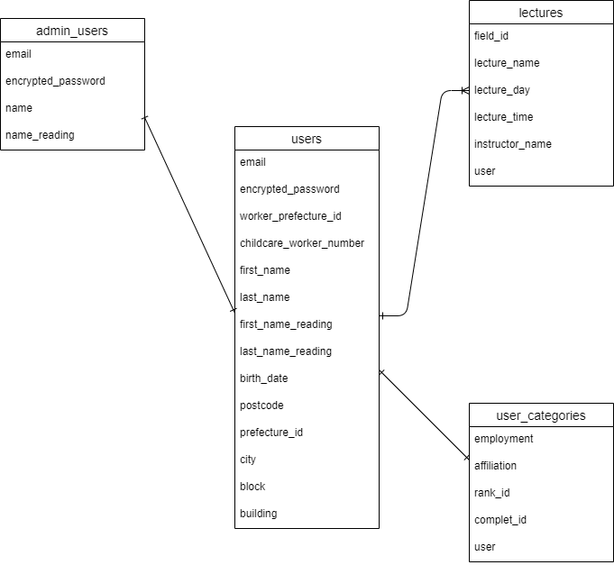
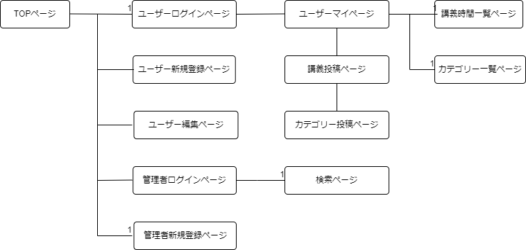

## name
professional-care

## URL

[professional-care](https://professional-care.onrender.com/)

## test　account

- Basic認証パスワード: admin
- Basic認証ID: 2222

# ユーザーログイン
- メールアドレス: test@test
- パスワード: ssssss1

# 管理者用ログイン
- メールアドレス: test@admin
- パスワード: aaaaaa1
- 新規登録パスワード: 14176

## image or gif

[Top page](https://gyazo.com/f9735ec8e5e88f2c8583be99abdd4850)

[My page](https://gyazo.com/8fe42dd1b69d982d9a01e0adbc3e9ef8)
## Overview
professional-careは、保育士のキャリアパスの仕組みを構築し、一定の技能・経験を有する職員への処遇改善を行い、職場への定着率を図ることを目的としたアプリケーションです。
保育士が自身のキャリアを可視化し、管理できる機能を提供します。また、管理者ユーザーは登録されたユーザーの一覧表を閲覧できます。

## Requirement
- widows
- HTML
- CSS
- Rails 6.0.6.1
- Ruby on Rails
- devise-4.9.2
- JavaScript
- MySQL
- GitHub

## Usage
- 通常ユーザーの使用方法:

1. 新規登録を行います。
2. ログイン後、マイページにアクセスします。
3. マイページで自分の研修内容を入力し、保存します。
4. 勤務年数を自動計算し、受講した研修内容とトータル時間を確認できます。

- 管理者ユーザーの使用方法:

1. 管理者ユーザーとして登録します。
2. ログイン後、ユーザーの一覧表にアクセスします。
3. ユーザーの名前で検索して情報を確認できます。

## Features

- 通常ユーザーは研修内容を保存し、勤務年数を自動計算できます。
- マイページから研修内容やトータル時間を確認できます。
- 管理者ユーザーはユーザーの一覧表を閲覧し、名前で検索できます。

## Background of Creation
仲良くさせていただいている園長さんとヒアリングし、「職員の管理ができるアプリがほしい」「今管理しているデータベースは様式が統一されていない」とお話をいただきました。
今の状態で再度データベースを1000人分入力する時間もないということでした。
1000人規模ということもあり職員本人に管理していただくのは如何と提案し、ユーザーマイページと管理者用のページを作成することにしました。

## Upcoming Features

- 県への提出に印刷機能を実装
- 検索機能の複数実装
- 退職ユーザーの削除機能
- 幼稚園・認定こども園にも対応できるように変換機能を実装

## Requirements Definition Document

[Document](https://docs.google.com/spreadsheets/d/17722MZKC78i3MzkhQtxadEbGtSCwe7b1vIo-6SNw4Q8/edit#gid=6460289450)

## Reference
- Railsチュートリアル: [リンク](https://railstutorial.jp/chapters/beginning?version=7.0#cha-beginningl)
- Qiita管理者ユーザー: [リンク](https://nllllll.com/ruby-on-rails/rails-devise/)

## Licence
- MIT

## professional-careのER図

## Screen Transition Diagram

